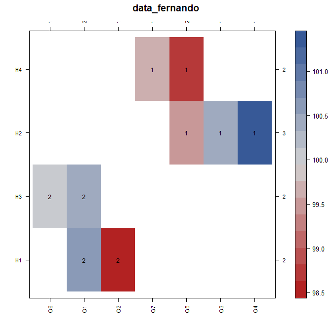

# connected  

[](https://cran.r-project.org/package=connected)
[](https://cranlogs.r-pkg.org/badges/connected)

Homepage: https://kwstat.github.io/connected

Repository: https://github.com/kwstat/connected

Tools to visualize and improve connectedness of factors in data

## Key features

* Simple to use.

## Installation

```R
# Install the released version from CRAN:
install.packages("connected")

# Install the development version from GitHub:
install.packages("devtools")
devtools::install_github("kwstat/connected")
```


## Usage

Check connectedness of multiple factors in a dataframe:

```R
library(connected)

# The 'row' and 'col' factors ARE connected in one group
con_check(data_eccleston, ~ row + col)
#  [1] 1 1 1 1 1 1 1 1 1 1 1 1 1 1 1 1

# But all three factors are COMPLETELY disconnected into 16 groups.
con_check(data_eccleston, ~ row + col + trt)
#  [1] 16 1  2  3  4  5  6  7  8  9  10 11 12 13 14 15
```

Visualize connectedness of two factors.  The cells with "1" and the cells with "2" are two disjoint groups.

```R
library(connected)
set.seed(42)
data_fernando <- transform(data_fernando, 
                           y = rnorm(nrow(data_fernando),mean=100))
con_view(data_fernando, y ~ gen * herd, main="data_fernando")
```



Improve connectedness of two factors with two-way filtering

```R
library(connected)
tab <- data.frame(gen=c("G1","G1","G1","G1", "G2","G2","G2", "G3"),
                  state=c("S1","S2","S3","S4", "S1","S2","S4", "S1"))
                    gen state
tab
# 1  G1    S1
# 2  G1    S2
# 3  G1    S3
# 4  G1    S4
# 5  G2    S1
# 6  G2    S2
# 7  G2    S4
# 8  G3    S1

library(janitor) # For tabyl

tab %>% tabyl(state,gen)
# state G1 G2 G3
#    S1  1  1  1
#    S2  1  1  0
#    S3  1  0  0
#    S4  1  1  0

# Now subset the data. Keep only states that have at least 2 genotypes.

# Read this as "2 state per gen"
tab2 <- con_filter(tab, ~ 2 * state / gen)
# Dropping these 1 of 3 levels of gen:
# [1] "G3"
# Deleted 1 of 8 rows of data.
# Warning message:
# In con_filter(tab, ~2 * state/gen) : Some state have only 1 gen.

tab2 %>% tabyl(state,gen)
# state G1 G2
#    S1  1  1
#    S2  1  1
#    S3  1  0
#    S4  1  1

```
