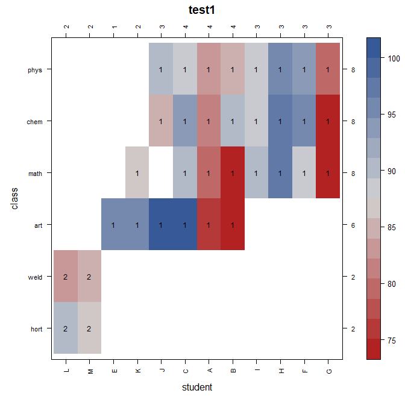

# connected  

[](https://cran.r-project.org/package=connected)
[](https://cranlogs.r-pkg.org/badges/connected)

Homepage: https://kwstat.github.io/connected

Repository: https://github.com/kwstat/connected

Tools to visualize and improve connectedness of factors in data

## Key features

Consistent function design:

* con_check(data, y ~ A + B) - Identify connected groups of factors.
* con_concur(data, y ~ A / B) - Plot concurrence matrix of two factors.
* con_filter(data, y ~ 2 * A / B) - Perform 2-factor filtering of data. Provide verbose output (similar to tidylog package).
* con_view(data, y ~ A + B) - View 2-way heatmap of factors, identify connected groups.

If there are missing values in the response variable `y`, the observations with missing values are deleted.

## Installation

```R
# Install the released version from CRAN:
install.packages("connected")

# Install the development version from GitHub:
install.packages("devtools")
devtools::install_github("kwstat/connected")
```


## Usage

1. Check connectedness of multiple factors in a dataframe:

```R
library(connected)

# The 'class' and 'student' factors are disconnected in 2 groups
R> con_check(data_student, test1 ~ class + student)
# [1] 1 1 1 1 1 1 1 1 1 1 1 1 1 1 1 1 1 1 1 1 1 1 1 1 1 1 1 1 1 1 1 2 2 2 2
```

2. Visualize connectedness of two factors.  The cells with "1" and the cells with "2" are two disjoint groups.

```R
library(connected)
con_view(data_student, test1~student*class, main="test1", xlab="student", ylab="class")
```



3. Improve connectedness of two factors with two-way filtering

```R
library(connected)
library(janitor) # For tabyl

data_student |> 
  tabyl(student,class)
# student art chem hort math phys weld
#       A   1    1    0    1    1    0
#       B   2    1    0    1    1    0
#       C   1    1    0    1    1    0
#       D   1    1    0    1    1    0
#       E   1    0    0    0    0    0
#       F   0    1    0    1    1    0
#       G   0    1    0    1    1    0
#       H   0    1    0    1    1    0
#       I   0    1    0    1    1    0
#       J   1    1    0    0    1    0
#       K   1    1    0    1    1    0
#       L   0    0    1    0    0    1
#       M   0    0    1    0    0    1

con_filter(data_student, test1 ~ 7*student/class) |>
  tabyl(student,class)
# Dropping these 3 of 6 levels of class:
# [1] "art"  "hort" "weld"
# Deleted 11 of 35 rows of data.
# student chem math phys
#       A    1    1    1
#       B    1    1    1
#       C    1    1    1
#       F    1    1    1
#       G    1    1    1
#       H    1    1    1
#       I    1    1    1
#       J    1    0    1
#       K    0    1    0
# Warning message:
# In con_filter(data_student, test1 ~ 7 * student/class) :
#   Some student have only 1 class.
```

4. View a concurrence matrix of two factors
```R
# Number of concurrent students for each pair of classes
con_concur(data_student, test1 ~ student/ class)
```
{width=5in}
